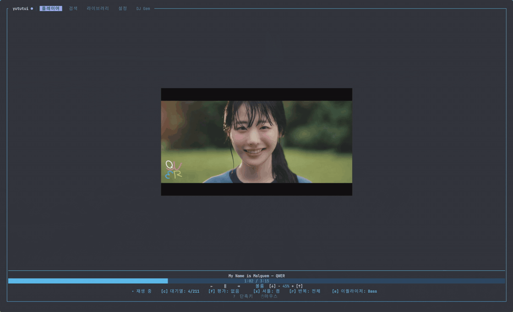
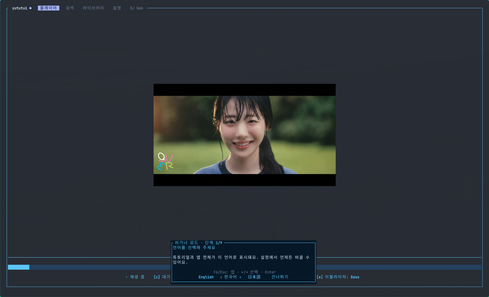
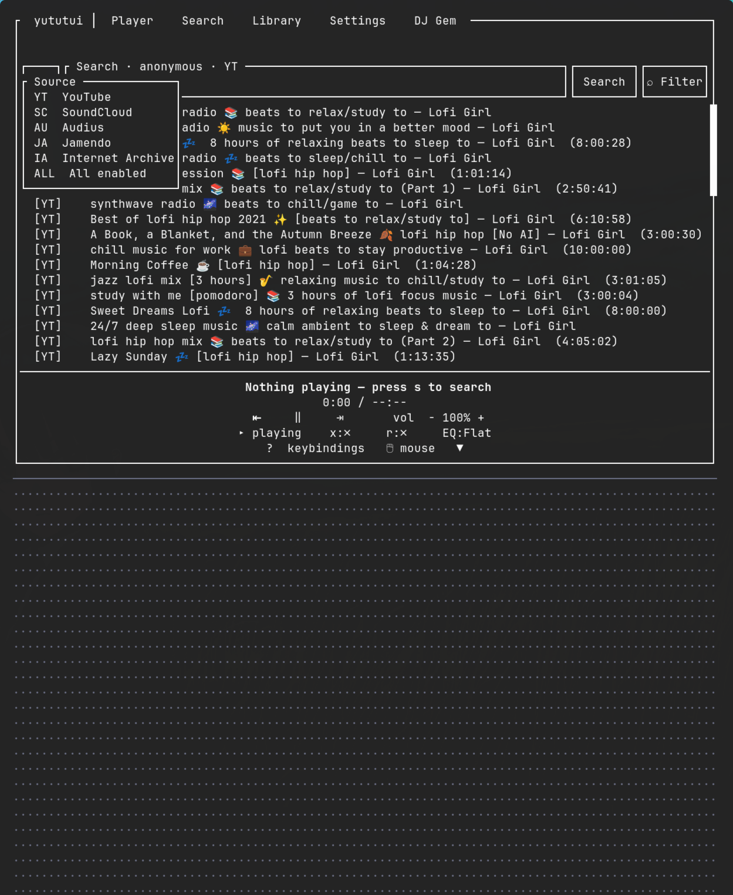
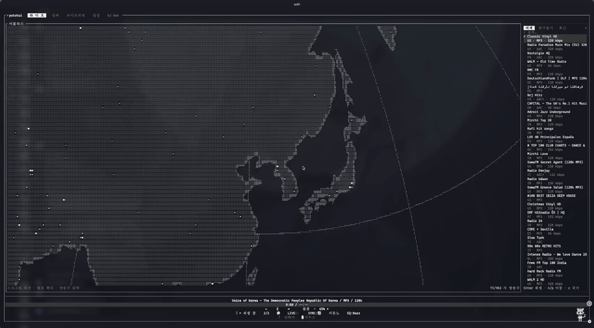
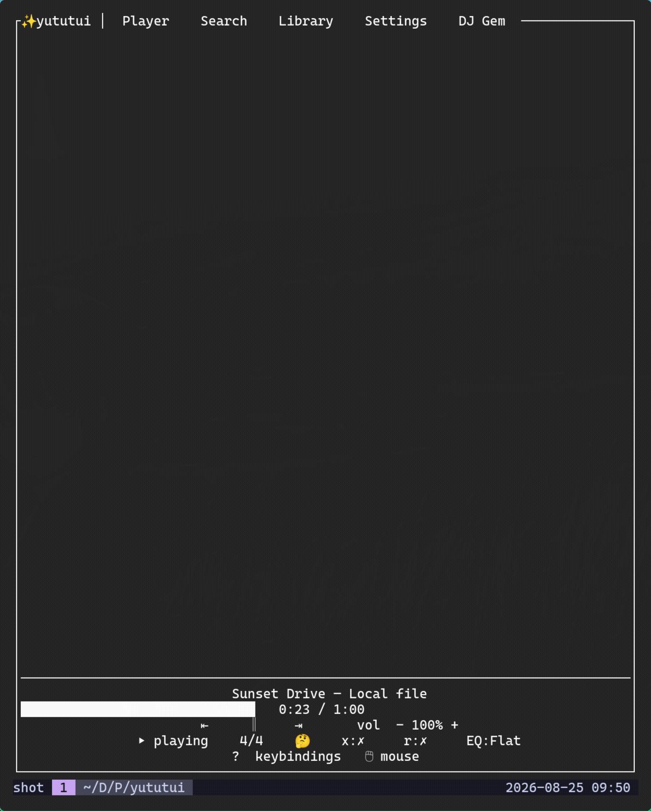
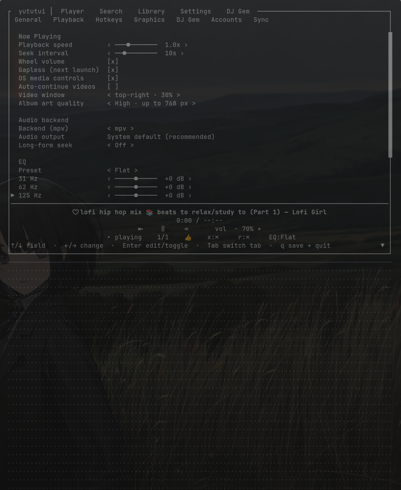
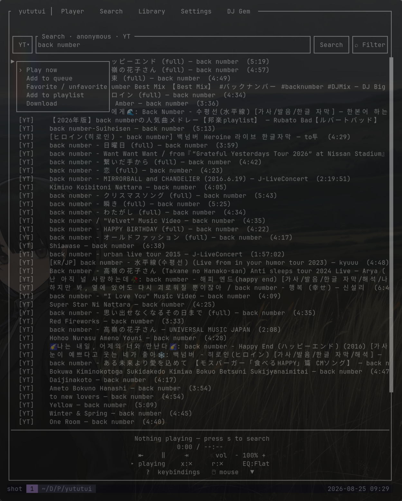

<p align="center">
  
</p>

# YuTuTui!

**English** · [한국어](README.ko.md) · [日本語](README.ja.md)

[](https://github.com/Ochichan/Yututui/releases)
[](https://github.com/Ochichan/Yututui/actions/workflows/ci-pr.yml)
[](https://github.com/Ochichan/Yututui/releases)
[](LICENSE)

YuTuTui! is a terminal music player for YouTube Music and other catalogs. Search, play, and manage your queue with the keyboard or mouse. Run it with `ytt`. It uses Rust and ratatui and is licensed under MIT.

[Atlas globe](#atlas-mode) · [DJ Gem & Momoring](#dj-gem) · [Step-by-step manual](MANUAL.md)



[View a static player screenshot](docs/media/player.png)

### [Live demo and feature tour](https://ochichan.github.io/Yututui/)

The [manual](MANUAL.md) covers music playback, radio and Atlas, DJ Gem, local files, and Spotify imports. ([한국어](MANUAL.ko.md) · [日本語](MANUAL.ja.md))

---

## Install

The package-manager commands (brew, scoop, nix, yay) install `ytt` **and** its helpers
(mpv, yt-dlp, ffmpeg) in one go. The direct installer and the source build install `ytt`
only. They check for the helpers and tell you what's missing.

| OS | One command |
| --- | --- |
| **macOS** | `brew install Ochichan/tap/yututui` |
| **Windows** | `scoop bucket add extras; scoop bucket add yututui https://github.com/Ochichan/scoop-bucket; scoop install yututui` |
| **Linux**, any distribution with [Nix](https://nixos.org/download) | `nix run github:Ochichan/Yututui` |
| **Linux**, Arch | `yay -S yututui-bin` |
| **Linux**, other distributions | Download and run the installer below |
| **From source** | `./install.sh --build` (needs [Rust](https://rustup.rs)) |

```sh
curl -fsSL https://raw.githubusercontent.com/Ochichan/Yututui/main/install.sh | bash
```

Windows direct installer:

```powershell
irm https://raw.githubusercontent.com/Ochichan/Yututui/main/install.ps1 | iex
```

<details>
<summary><b>Verify what you download</b> <i>(optional)</i></summary>

Every release ships `checksums.txt` (SHA-256) and GitHub build-provenance attestations.
To avoid running an installer fetched from a moving branch, pin it to the latest release:

```sh
curl -fsSL https://github.com/Ochichan/Yututui/releases/latest/download/install.sh | bash

# Checksums (artifact + checksums.txt in the same directory):
sha256sum -c --ignore-missing checksums.txt        # macOS: shasum -a 256 -c

# Provenance — proves the artifact came from this repo's release workflow (GitHub CLI):
gh attestation verify yututui-linux-x64.tar.gz --repo Ochichan/Yututui
```

</details>

On Windows, launch **YuTuTui!** from the Start Menu. The tray companion opens Windows Terminal
and starts `ytt` for you; its right-click menu also has **Open Player**. Double-clicking
`ytt.exe` directly is supported too, and the console stays open after exit so an error is not
lost. macOS offers the same **Open Player** action from its menu-bar companion. Linux keeps the
lightweight native path: run `ytt` from your terminal or make a desktop launcher for that command.

Run `ytt` to start the player. Use `ytt doctor` to check missing tools and configuration problems. See [Troubleshooting](#troubleshooting).

<details>
<summary><b>Tray companion (macOS / Windows)</b></summary>

macOS and Windows releases include `yututray`, the menu-bar / notification-area mini player.

| Channel | What gets installed | How to start the tray |
| --- | --- | --- |
| macOS Homebrew | `ytt`, `yututray`, runtime tools | `yututray --background` |
| Windows Scoop | `ytt.exe`, `yututray.exe`, runtime tools, Start Menu shortcut | `yututray --background` or **YuTuTray!** |
| Direct installers / source build scripts | `ytt`; macOS/Windows also get `yututray` | `yututray --background` |
| Linux | `ytt` with MPRIS media integration | no separate tray app |

Start-at-login is opt-in: `yututray --install-startup`.

`yututray` and `yututray --background` start tray-only, and `--mini` opens the native mini player.
Launching the bare
command again asks the existing instance to show its mini player instead of creating a second tray
icon. On Windows, left-click
toggles the mini player and right-click opens the menu; macOS keeps the native menu on the status
item and exposes the mini player from **Show Mini Player**.

The unpinned mini player behaves like a popover and hides after focus moves away. Pinning keeps it
visible, always on top, and restores its monitor-relative position. Tray-only and mini-only modes
stay out of the taskbar/Dock and app switcher.

</details>

### Runtime tools

YuTuTui! uses **mpv** for playback, **yt-dlp** for search/stream resolution, and **ffmpeg** for
download post-processing. Packaged installs include them. If a direct or source install is
missing one, the app shows a setup card with a copyable OS command, setup guide, and
**Check again** button instead of exposing a process error. `ytt doctor` remains the detailed
diagnostic command. POSIX systems require **mpv 0.33 or newer** for the inherited lifetime lease.

`ytt` routes mpv launches through a private guardian. The guardian uses an owner heartbeat; POSIX
adds an inherited mpv `fd://` IPC lease, Linux also adds `PR_SET_PDEATHSIG`, and Windows instead
uses kill-on-close Job Objects. These bind mpv to the `ytt` owner. The
standalone Unix TUI also fails closed when it loses a recognized direct/conmon PTY or a supported
tmux/screen/Zellij client; an inaccessible or ambiguous multiplexer query must fail twice before
shutdown. Normal Windows console-control events are handled too. A retained ConPTY/tmux-control
broker and repeated same-type tmux/Screen/Zellij nesting cannot be proven detached from inside the client; use `ytt daemon`
or a host-side lifetime supervisor/lease for those cases. See
[terminal compatibility](docs/terminal-compatibility.md#terminal-lifetime-detection).

## Quick start

```sh
ytt
```

On a new profile, a ten-second hint points to **Search**. Press the displayed search key
(normally `s`) or click **Search**; completing the hint once keeps later launches clean.

1. Press **`s`**, type a song, hit **`Enter`**.
2. Move with **`↑`/`↓`**, press **`Enter`** to play.
3. Press **`?`** anytime for the full, always-current key list.

For guided setup, enable **Beginner Mode** in Settings → General. The next launch opens a nine-step walkthrough, starting with a choice of English, 한국어, or 日本語. The [manual](MANUAL.md) explains each mode.

<details>
<summary>Preview the Beginner Mode walkthrough</summary>



</details>

## Resource use

Measured on 2026-09-30 with official ytt 1.7.7 binaries. Album art and all animations were off. Each state used a separate profile and a 100×30 terminal, with 30 seconds of warmup followed by about 60 seconds of sampling at 1 Hz, repeated three times.

The first table covers the main `ytt` TUI process. The second includes its guardian and mpv. CPU values are time-weighted means; one fully occupied logical core is 100%. RSS is resident memory, and 1 MiB is 1,048,576 bytes.

| OS | State | CPU % | RSS MiB | DIRTY / private WS MiB |
| --- | --- | --- | --- | --- |
| macOS | Idle | 0.078 | 23.36 | 6.56 |
| macOS | Playback + Streaming ON | 0.222 | 50.77 | 22.27 |
| Debian | Idle | 0.267 | 30.67 | 10.12 |
| Debian | Playback + Streaming ON | 0.422 | 33.80 | 12.50 |
| Windows | Idle | 0.427 | 20.84 | 4.04 |
| Windows | Playback + Streaming ON | 0.800 | 28.32 | 5.51 |

<details>
<summary>Including the playback processes</summary>

| OS | State | CPU % | RSS MiB | DIRTY / private WS MiB |
| --- | --- | --- | --- | --- |
| macOS | Idle | 0.100 | 141.06 | 47.39 |
| macOS | Playback + Streaming ON | 1.730 | 312.55 | 192.57 |
| Debian | Idle | 0.372 | 93.74 | 26.96 |
| Debian | Playback + Streaming ON | 2.350 | 133.56 | 54.90 |
| Windows | Idle | 0.514 | 57.36 | 16.86 |
| Windows | Playback + Streaming ON | 3.834 | 91.07 | 37.80 |

</details>

Idle had no queued track, playback, or input. Playback used "心臓を捧げよ！" by Linked Horizon, video ID `8QPyFlJNmus`, with Streaming ON. mpv fetched and decoded the real YouTube Music stream using null audio output. Audio-device output costs are excluded.

The OS memory column uses different native metrics: macOS `vmmap` DIRTY, Linux `Private_Dirty + Shared_Dirty`, and Windows private working set. Windows private working set is not dirty memory. macOS values average six start/end snapshots per state; Linux and Windows values average 180 samples. Summed RSS can count shared pages more than once.

<details>
<summary>Test machines and tools</summary>

| OS | CPU / logical cores / RAM | mpv | yt-dlp |
| --- | --- | --- | --- |
| macOS 27.2 | Apple M5 Pro / 18 / 64 GiB | 0.41.0 | 2026.08.19 |
| Debian 13.7 | Ryzen 5 7530U / 12 / 13.58 GiB | 0.40.0 | 2026.09.27.232945 |
| Windows 11 | Intel i5-1340P / 16 / 15.69 GiB | 0.41.0-dev | 2026.08.19 |

</details>

These are measurements of three different machines, not an OS efficiency ranking. Hardware, dependency versions, background load, and measurement times differed. Album art display was off, but artwork metadata/cache fetching still occurred. Windows used system yt-dlp after a managed-update warning about missing GnuPG; shutdown also logged a persistence warning. Accepted runs passed rendering, playback-progress, and process-cleanup checks.

## Tour

Explore the main modes below, or try the **[interactive feature tour](https://ochichan.github.io/Yututui/)**.

### Album art and synced lyrics

The player draws cover images using Kitty, Sixel, or iTerm2 image protocols, detected automatically. Choose Standard, High, or Original quality in Settings.

Press **`Shift+L`** to show synced lyrics below the art. Click a visible lyric line to seek to that point. **`z`** and **`Shift+Z`** shift lyrics 0.1 seconds earlier or later. The **`[ − 0.0s + ]`** controls appear for three seconds when lyrics load, then fold into **`[±]`**. Click that handle to reopen the adjustment controls for three seconds.

Playback controls dock to the bottom of each screen; **`Shift+B`** collapses them. Settings also offers the classic top layout. Album art stays centered in the remaining space. Below about 32×14, the app switches to a miniplayer and restores the full layout when the window grows.

### Seven catalogs, one search box

Press **`Tab`** in Search to select YouTube Music, SoundCloud, Audius, Jamendo, Internet Archive, Radio Browser, or your OpenSubsonic server. You can also search all catalogs at once. Each result has a `[SRC]` tag.



### Radio mode

**`Alt+Shift+R`** turns the app into an internet-radio tuner with separate favorites and listening history. Press **`i`** to see the song information supplied by the station; no Gemini key is needed. When a song is identified, **`f`** inside the card saves it to your music favorites. Stations that do not send song metadata cannot show a track name here.

<a id="atlas-mode"></a>

### Atlas mode

In Radio mode, press **`a`** to explore stations on an interactive globe. Drag to rotate, scroll to zoom, click a signal to listen, or pick a country and browse its stations. The side panel brings together world stations, favorites and recent listening.



*8-second preview from the screen recording.* [Watch the full 27-second demo (silent)](docs/media/atlas.mp4) · [Atlas controls and settings](MANUAL.md#atlas-mode)

Drawn with Braille or ASCII characters, Atlas needs no terminal image protocol. Use **`/`** to search, **`Tab`** to switch between globe and panel, and **`q`** to close. A larger terminal shows more of the globe and station list.

### DJ Gem streaming

**`Ctrl+R`** builds an endless station around what you're hearing. Recommended tracks carry a clickable **`?`** in the queue and beside Now Playing. Press **`w`** with the queue open to explain its selected row; anywhere else, it explains the current track. The card always names the recommendation source and, when DJ Gem supplied them, adds its role, plain-language reasons and confidence. Picks made without model detail show the source alone.

<a id="dj-gem"></a>

### DJ Gem assistant *(optional)*

**`g`**, then ask in plain words: *"play some lo-fi", "make me a rainy-day playlist"*. Set a Gemini API key in **Settings → DJ Gem** and turn **DJ Gem chat** on. Music search, playback, radio and Atlas work without a Gemini key.

Momoring is an animated Braille mascot on the empty DJ Gem chat screen. She animates during music playback and uses your theme colors.

<p align="center">
  
</p>

*3-second mascot close-up.* [Setup, chat and animation controls](MANUAL.md#dj-gem).

### Music videos

**`v`** opens it in a small mpv window; *Auto-continue videos* hands each video off to the next track's, and the mpv window answers `Space`, `.`, `,`, `q`, `f`, `m`.

### Library, queue & downloads

Build playlists in the Library (or let DJ Gem build them), pop the queue with **`c`**, and **`d`** saves a tagged m4a with cover art. **`Shift+D`** grabs the whole list.

### Local Deck

**`Alt+Shift+L`** in the Library opens a player for your downloads and local files, organized by album, artist, genre, and smart lists. Choose **Find** or press **`Ctrl+F`** to search tracks, albums, artists, genres, folders and locally playable playlist entries without an online fallback; **`/`** still filters only the section you're viewing. Refine the scope or sort, open a collection, or play/enqueue one result or the whole result mix.

Local playback and Find use only files already on your computer. Other opt-in integrations may still use the network, and the manual online-candidate search in **Import Sessions** explicitly asks before leaving the Local Deck. The Local Deck also remembers its own theme separately from normal and Radio modes: a fresh or older installation starts it with **Local Launch**, then restores whichever Local theme you save there. The [manual](MANUAL.md) has the full tour.

### Control from anywhere

Control playback with media keys, macOS Control Center, Windows SMTC and the tray mini player, Linux MPRIS, or `ytt -r`. Use the headless daemon for playback without a terminal.

### Appearance and audio

Choose from 14 theme presets or edit all 34 color roles in Custom. The app has 40 animations, including shooting stars, an ASCII donut, fireworks, Game of Life, pipes, and plasma. Audio settings include a 10-band EQ with presets, output-device selection, and loudness normalization. Change the UI language in Settings → General → **Language**: English, 한국어, or 日本語.



<details>
<summary>View playback, audio output and EQ settings</summary>

<a href="docs/media/audio-output.png"></a>

</details>

### Retro mode

Retro mode uses CP437-compatible characters for Linux consoles and older SSH terminals. It renders album art as ASCII and sets the UI language to English because CP437 has no CJK glyphs.

### Spotify imports

Use `ytt transfer import <url>` to import a Spotify playlist. Imports save checkpoints, support resume, and report ambiguous matches. See the [reference](#reference) for setup or the [manual](MANUAL.md) for a walkthrough.

### Keybindings and mouse controls

Press **`?`** to see your current keybindings. Rebind app actions in Settings → Hotkeys. Mouse controls are supported throughout the UI; safety and modal keys remain fixed.

<details>
<summary>View the track context menu</summary>

<a href="docs/media/context-menu.png"></a>

</details>

## Essential keys

These are the default Player keys outside text fields; [Atlas has its own controls](MANUAL.md#atlas-mode).

Press **`?`** for all current bindings. Change app actions in Settings → Hotkeys; safety and modal keys remain fixed.

| Key | Does |
| --- | --- |
| `Space` | Play / pause |
| `,` / `.` | Previous / next (also inside the mpv video window) |
| `←` / `→` · `↑` / `↓` | Seek · volume |
| `s` | Search (`Tab` picks the catalog) |
| `l` / `c` | Library / queue |
| `x` / `r` | Shuffle / cycle repeat |
| hold `↑`/`↓` · `Shift`+`↑`/`↓` | Fast-scroll a list (accelerates) · extend the selection |
| `f` / `d` | Rate like/dislike (or favorite a selected Library row) / download |
| `Shift+D` | Download the whole list / playlist |
| `Shift+L` | Synced lyrics; click a visible line to seek there |
| `z` / `Shift+Z` | Show lyrics 0.1s earlier / later (`[±]` reopens `−/+` for 3s) |
| `v` | Music-video overlay |
| `!` / `@` | Jump to the previous / next chapter (mpv-style) |
| `Shift+S` | Sleep timer. Set minutes (or `off`), fade-out, then pause |
| `Shift+B` | Collapse / expand the docked control box |
| `←` / `→` · `Ctrl+←` / `Ctrl+→` | Move by one character · one word in a text field |
| `Backspace` / `Ctrl+Backspace` | Delete a character / previous word in a text field |
| `Ctrl+H` | Return to the Player (on legacy ambiguous terminals, the safe text-edit fallback takes priority) |
| `Alt+Shift+R` | Enter / leave Radio mode |
| `a` | Open / close Atlas from the Radio Player |
| `Ctrl+R` | DJ Gem streaming |
| `w` | Explain the selected queue recommendation, or the current track |
| `g` | DJ Gem assistant |
| `o` | Settings |
| `Ctrl+Q` | Quit |

> Shortcuts accept Korean 두벌식 jamo, so `ㅂ` works like `q` without switching input. Use the mouse wheel to adjust volume, drag rows to select a range in Search or the Library, and `Ctrl`+click to toggle individual rows. On macOS, use `⌘`+click. Right-click a row for its context menu. Remap gestures under `mouse_bindings` in `config.json`; the footer **mouse** button lists mouse controls.

## Troubleshooting

`ytt doctor` checks mpv, yt-dlp, and ffmpeg. Use `ytt doctor --verbose` for detailed diagnostics or `ytt doctor terminal --json` to check terminal capabilities.

### Playback

| Symptom | Fix |
| --- | --- |
| Nothing plays, or it errors on play | mpv or yt-dlp missing. Run `ytt doctor`. |
| Sound goes to the wrong device | Settings → Playback → **Audio output** picks from the detected local outputs; **Audio backend** exposes the mpv options. |
| Worked yesterday, not today | YouTube changed something. `ytt tools update`, then `ytt tools status --why`; if a managed update is bad, `ytt tools use system`. |
| Several tracks fail with 403/429 or "YouTube rejected the stream" | YouTube may be applying a bot check or rate limit. Run `ytt doctor --verbose`, check the [cookies reference](#reference) and your JS runtime; `ytt tools status --why` shows the active yt-dlp. Follow the official [PO Token Guide](https://github.com/yt-dlp/yt-dlp/wiki/PO-Token-Guide) when a token is needed. |
| A specific song won't play | It may need sign-in. See the cookies section in the [reference](#reference). |
| The app runs a different yt-dlp than your shell | That's by design (managed copy vs `PATH`). See *yt-dlp selection* in the [reference](#reference). |

### Install & startup

| Symptom | Fix |
| --- | --- |
| `ytt: command not found` | Open a fresh terminal; still stuck, add the `PATH` line the installer printed. |
| Direct installer / source build is missing helpers | The one-line installers only install `ytt` itself. `ytt doctor` lists what to install and how. |

### Display & terminals

Terminal support varies by emulator. YuTuTui! probes capabilities and falls back where possible. Check your environment with `ytt doctor terminal --json` and compare with the [terminal compatibility matrix](docs/terminal-compatibility.md).

| Symptom | Fix |
| --- | --- |
| No album art | Off by default: Settings → General → **Album art**, then restart. |
| Album art or zoom behaves differently by terminal | Run `ytt doctor terminal --json` and compare with the [terminal matrix](docs/terminal-compatibility.md). |
| A terminal-liveness error closes the TUI | Run `ytt doctor terminal --json` and keep the error's failure class/stage. EOF/HUP and a confirmed multiplexer detach are immediate; ambiguous cursor replies and owner-layer queries need two independent observations. Liveness output-gate contention defers the probe, while owner frame/control output has its own seven-second deadline. Use `ytt daemon` only when playback should outlive the terminal. |
| `Ctrl+Backspace` acts like `Ctrl+H`, or Player navigation is suppressed | See [keyboard input modes](docs/terminal-compatibility.md#keyboard-input-modes). Direct modern terminals negotiate an exact protocol when supported; legacy/multiplexed sessions reserve ambiguous `^H` for safe word deletion while that binding remains at its default. |
| Album art looks blocky in VS Code / Apple Terminal | Those terminals have no image protocol. Halfblocks are the intended fallback there. |
| Bare Linux console or an old SSH session looks broken | Switch on retro mode (Settings → Graphics): everything redraws CP437-safe, album art becomes ASCII art. |
| `v` (music video) does nothing over SSH / a bare TTY | The video overlay is an mpv GUI window. It needs a desktop session. |

### Spotify import

| Symptom | Fix |
| --- | --- |
| Spotify 403 / "not allowlisted" | Add your own account under *User Management* in your Spotify app dashboard, and check the Client ID for typos. |
| Browser shows INVALID_CLIENT / redirect mismatch | The redirect URI must match **exactly**: `http://127.0.0.1:9271/callback`. IP not `localhost`, correct port, no trailing slash. |
| "could not listen on 127.0.0.1:9271" | That port is busy. Set `spotify.redirect_port` in `config.json` and update the dashboard redirect URI to match. |
| Clicked Connect but no browser opened | On headless/SSH the auth URL is copied to your clipboard and saved to `spotify_auth_url.txt`. Paste it into any browser to approve. |
| Spotify import "needs a YouTube Music cookie" | Importing into a YTM playlist/likes needs sign-in; importing into a local Library playlist works without one. See the cookies section in the [reference](#reference). |

### Accounts, scrobbling & OS integration

| Symptom | Fix |
| --- | --- |
| Scrobbles not appearing | Check Settings → Accounts; the daemon reads accounts at start. Restart it after connecting. |
| No Control Center / SMTC / MPRIS entry | Settings → Playback → **OS media controls**; it publishes once something has played. |
| Flyout shows "Unknown app" / two entries | Run `ytt register-media-identity` once (two entries = mpv's own media session; auto-disabled on mpv ≥ 0.39). |
| No desktop update notification | Update notices still appear in About/status; desktop notifications are best-effort and depend on terminal, tmux, and OS notification support. |

### Everything else

| Symptom | Fix |
| --- | --- |
| DJ Gem won't respond | Set a Gemini API key in Settings → DJ Gem and turn **DJ Gem chat** on. `GEMINI_API_KEY`, if set, overrides the saved key. |
| Momoring is still or missing | Open an empty DJ Gem chat in a wider terminal. Animation needs a playing queued track and animations enabled (`A` on the Player). |
| Atlas will not open / panel missing | Enter Radio mode first (`Alt+Shift+R`), enlarge the terminal, then press `a`. `Tab` reveals the panel when there is room. |
| Remapped a key into chaos | Settings → General → **Reset keybindings**. |

Still stuck? [Open an issue](https://github.com/Ochichan/Yututui/issues) and mention your OS.

## Reference

<details>
<summary><b>Remote control & daemon</b></summary>

Once `ytt` is playing, control it from any shell:

```sh
ytt -r pp                  # play / pause      (aliases: toggle, play, pause)
ytt -r next / prev         # skip around
ytt -r volume 40           # set volume; also: up / down
ytt -r seek-to 90          # jump to 1:30
ytt -r streaming on        # endless streaming: on / off / toggle
ytt -r play "lofi"         # daemon: search and play the first result
ytt -r status              # one-line "now playing" (--json for scripts)
ytt -r info                # owner mode, protocol and capabilities (never the token)
ytt -r queue-list          # numbered queue; the current row starts with >
ytt -r queue-play 2        # play queue row 2 (queue numbers start at 1)
ytt -r settings-show       # compact, non-secret settings summary
ytt -r watch --json        # live player/queue/system events as NDJSON (the default topics)
ytt -r watch all           # all published topics: player, queue, settings, system
```

Media keys on i3 / sway: `bindsym XF86AudioPlay exec ytt -r pp`.

Remote control stays on the same machine and is scoped to the current OS user through a private
Unix socket or Windows named pipe. It is not a LAN/HTTP remote: never share or expose its runtime
directory. Queue numbers shown by `queue-list` are 1-based.

For terminal-free playback, run the headless daemon:

```sh
ytt daemon start --resume   # restore the saved queue/session and play
ytt daemon stop             # stop the daemon and reap mpv
```

The daemon keeps streaming, scrobbling and OS media controls working. Launching `ytt` twice won't start a second player (`ytt --new-instance` if you really want two). Full lists: `ytt -r --help`, `ytt daemon --help`.

</details>

<details>
<summary><b>Scrobbling setup (Last.fm / ListenBrainz)</b></summary>

`ytt` uses the standard half-track/4-minute scrobbling rule and syncs likes to Last.fm loves. It saves pending scrobbles to disk before attempting delivery, so they can be retried after a crash. Scrobbling works in both the TUI and daemon.

- **Last.fm**. Settings → **Accounts** → approve in the browser, or `ytt auth lastfm`. Self-built binaries can set `scrobble.lastfm.api_key` / `api_secret` in `config.json` ([create an API account](https://www.last.fm/api/account/create)).
- **ListenBrainz**. Paste your [user token](https://listenbrainz.org/settings/) into Settings → Accounts, or `ytt auth listenbrainz <token>`. Self-hosted: set `scrobble.listenbrainz.api_url`.
- Undelivered listens wait in `scrobble-queue.jsonl` next to your config and flush automatically.

</details>

<details>
<summary><b>Spotify import / export</b></summary>

```sh
ytt auth spotify --client-id <YOUR-CLIENT-ID>   # one-time PKCE browser connect
ytt transfer import <spotify-url-or-id>          # → a new YTM playlist
ytt transfer import liked --to likes             # Spotify likes → YTM likes (order kept)
ytt transfer import <url> --media music-video    # → a separate official-family MV playlist
ytt transfer import liked --media music-video    # the same MV mode for Spotify Liked Songs
ytt transfer import <url> --policy strict        # stricter review-heavy matching
ytt transfer export ytm:<id> --to spotify        # create/append on Spotify (not a live sync)
ytt transfer export ytm:<id> --to spotify:<22-character-playlist-id> --sync --dry-run
                                                  # preview an exact mirror into an existing playlist
ytt transfer backup --dir ~/music-backup --csv   # every YTM playlist → JSON (+CSV)
ytt transfer resume <job-id>                     # continue after a rate-limit/abort
```

Or stay in the TUI: Settings → **Accounts** → *Import from Spotify…* while the music keeps playing. Its fourth mode, **Music video playlist**, writes a separate playlist into Library → Playlists.

**One-time setup (~5 min).** Spotify apps in Development Mode only serve accounts you explicitly allowlist, so everyone brings their own personal app. Under [Spotify's 2026 Dev-Mode rules](https://developer.spotify.com/documentation/web-api/tutorials/february-2026-migration-guide), the app owner needs Premium, a new app gets one Client ID, and it can serve up to five allowlisted users. There is no client *secret*. PKCE doesn't use one.

1. Sign in at [developer.spotify.com/dashboard](https://developer.spotify.com/dashboard) and click **Create app**.
2. Give it any **App name** and **App description** (e.g. `yututui`).
3. Under **Redirect URIs**, add exactly `http://127.0.0.1:9271/callback` and click **Add**. It must be the loopback IP literal `127.0.0.1`, **never `localhost`** (Spotify rejects `localhost`). Using a different port? Set `spotify.redirect_port` in `config.json` and match it here.
4. Under **Which API/SDKs are you planning to use?**, tick **Web API**.
5. Accept the terms and **Save**.
6. Open the app → **Settings** and copy the **Client ID** (you do *not* need the Client secret).
7. Open **User Management** (in the app's settings) and add your own account using your name and Spotify account email. New Dev-Mode apps serve up to five such allowlisted users.
8. In ytt: **Settings → Accounts → Spotify**, paste the Client ID, and choose **Connect** (or run `ytt auth spotify --client-id <ID>`). Your browser opens Spotify's approval page. Approve it and you're done. On headless/SSH where no browser opens, the URL is copied to your clipboard and saved to `spotify_auth_url.txt`, so you can open it on any device.

Matching is metadata-based (NFKC-normalized, CJK-safe) and resolves Spotify imports cache-first, album-aware, and YTM-catalog-first before falling back to public YouTube videos. The CLI default is `--policy balanced`; use `--policy strict` for conservative review-heavy matching, `--policy aggressive` for fewer review rows, and `--allow-user-videos` only if generic public uploads are acceptable. Anything still ambiguous lands in the job report instead of being silently guessed. Re-run with `--take-best` / `--min-score`, or preview big playlists with `--dry-run` and then `ytt transfer resume <job-id>`.

`--media music-video` works with a Spotify playlist or `liked` and creates a separate `<source> (Music Videos)` playlist unless you supply a destination name. It prefers YouTube Music's OMV / OfficialSourceMusic classifications and strongly corroborated official channels. That is a best-effort official-family check, not a 100% guarantee: the public APIs do not expose a definitive “official music video” flag. Hard-rejected user uploads cannot be forced through review, and unresolved candidates stay in the report.

The ordinary `--to spotify` export is intentionally non-destructive: it finds or creates a playlist (creation uses Spotify's current `POST /me/playlists` API) and appends missing matches. It does not remove Spotify-only tracks, reproduce duplicate positions, reorder the playlist, or keep watching for later edits.

For a destructive, one-shot exact mirror, use an explicit playlist ID with `--to spotify:<22-character-playlist-id> --sync`. Only a playlist owned by the connected account is accepted. Run `--dry-run` first: the preview shows additions, removals and reordering, and nothing is changed if even one source row is unresolved or the source was truncated. The real run preserves source order and duplicate occurrences and removes destination-only tracks. Without `--yes` it previews and asks before replacing anything; `ytt transfer resume <job-id>` builds a fresh preview and asks again (`resume <job-id> --yes` deliberately skips that confirmation).

</details>

<details>
<summary><b>Sign-in cookies & file locations</b></summary>

**YouTube access.** For token requirements and provider setup, follow yt-dlp's [PO Token Guide](https://github.com/yt-dlp/yt-dlp/wiki/PO-Token-Guide). YouTube OAuth login no longer works with yt-dlp; use the official [cookie export instructions](https://github.com/yt-dlp/yt-dlp/wiki/Extractors#exporting-youtube-cookies) when account access is needed. `ytt doctor --verbose` reports local tool readiness; a detected legacy OAuth plugin does not establish that sign-in works.

**Cookies (optional).** For content requiring an account, export YouTube Music cookies in **Netscape format** to `~/Music/yututui/cookies.txt` (Windows: `%USERPROFILE%\Music\yututui\cookies.txt`) and restart. **Treat the file like a password.** Follow the export instructions above; cookies can expire, and they do not guarantee access to region-restricted content.

**Config & data.**

- Config: `~/Library/Application Support/yututui/config.json` (macOS) · `~/.config/yututui/config.json` (Linux) · `%APPDATA%\yututui\config.json` (Windows). The same directory holds `playlists.json`, `scrobble-queue.jsonl`, and `transfers/`.
- Downloads: `~/Music/yututui`. Change via the **Download dir** setting or `YTM_DOWNLOAD_DIR`.
- `GEMINI_API_KEY` and `YTM_DOWNLOAD_DIR` override saved settings at launch.

**Portable personal-data export.** Choose **Settings (`o`) → General → Export personal data**, or run:

```sh
ytt data export                         # save to the OS Downloads folder
ytt data export --to ~/existing-folder # choose an existing directory
```

`--to` takes a directory, not a filename, and does not create it. A destination where another local account could replace the finished file is rejected. The result is a new, owner-private, never-overwritten, versioned JSON file containing sanitized portable settings; track and radio favorites; listening and radio history; playlists and safe track metadata/public catalog IDs; and recommendation signals, artist affinities and station preferences.

If the primary app or daemon is running, the CLI exports that owner's current in-memory state. With additional `--new-instance` players, the CLI still exports only the advertised primary; use each secondary's Settings screen for its live state. Offline export refuses to read the stores while any current-version ytt owner is active.

It excludes authentication cookies, API keys, OAuth tokens and account identifiers; every filesystem path and machine-specific audio setting; playable, origin, artwork and radio-stream URLs; downloaded/recorded media, manifests and sidecars; pending scrobbles, transfer jobs/reports and session queues; AI usage logs, generated caches, artwork caches and application logs; managed-tool binaries and paths, desktop geometry and recovery backups.

The JSON is **not encrypted** and still contains private listening history, so store or share it accordingly. See the export/import reference below for bringing one back in.

</details>

<details>
<summary><b>yt-dlp selection</b></summary>

`ytt` maintains a managed yt-dlp copy, verifies its downloads with SHA-256, and selects the newer of the managed and system versions. It may therefore run a different yt-dlp than the one your shell prints with `yt-dlp --version`. To see the actual choice and candidates:

```sh
ytt tools status --why
```

Recovery commands:

```sh
ytt tools update              # refresh the managed copy now
ytt tools use system          # ignore managed yt-dlp and use PATH
ytt tools use managed         # pin the installed managed copy
ytt tools use /path/to/yt-dlp # pin a specific executable
ytt tools unpin               # return to normal managed/system selection
```

`YTM_YTDLP` is still the strongest override. If you change it in your OS settings, open a fresh terminal or unset it before expecting `ytt tools use ...` to take over.

The app's own yt-dlp calls ignore your yt-dlp config file by default, so options meant for shell downloads do not break parsed output. Set `YTM_YTDLP_USER_CONFIG=1` to re-enable your yt-dlp config for app-parsed calls. Playback through mpv's `ytdl_hook` still honors your yt-dlp config; only search, playlist fetches, metadata, prefetch resolution, and downloads ignore it by default.

</details>

<details>
<summary><b>Encrypted sync across devices</b></summary>

Keep favorites, history, playlists and taste signals in step across machines through a WebDAV
folder (Nextcloud, ownCloud, most NAS boxes). The app encrypts data locally before upload.
The server stores ciphertext and can see file sizes and timestamps. Sync is off by default.

```sh
ytt sync setup                        # create the vault; writes a required recovery kit
ytt sync status [--json]              # Off / Up to date / Syncing / Offline — will retry / Needs attention
ytt sync now                          # merge local and remote state now

ytt sync pair create                  # print a ten-minute, one-time connection code
ytt sync pair join <CODE>             # on the new device; approve on the old one
ytt sync pair join --resume           # continue an interrupted join, no code needed
ytt sync pair cancel                  # discard an unfinished local join

ytt sync devices [--json]             # active and removed devices
ytt sync revoke <DEVICE_ID>           # remove a device and rotate the encrypted checkpoint
ytt sync recovery export --to <DIR>   # verify and copy the recovery kit
ytt sync audit [--json]               # redacted sync audit log
```

WebDAV credentials are prompted with echo disabled and are never accepted as arguments. The
endpoint must be HTTPS unless it is loopback. Status and audit output deliberately omit
endpoints, paths and secrets.

Self-signed or private-PKI endpoints can pin a custom CA (PEM) per connection; the PEM never
leaves the device and is never logged. Custom-CA trust is covered by an automated test that is
green on Linux, Windows, and hosted macOS 15. One local macOS machine recorded a Secure
Transport rejection (`errSSLClosedAbort -9806`, 2026-07-26) that CI has never reproduced. If
custom-CA trust fails for you, please report it with your macOS version.

**Keep the recovery kit off this machine.** Nobody can regenerate it for you. Note that no
command rebuilds a vault from the kit alone yet, so keep at least one approved device rather
than treating the kit as a restore. Revoking a device re-locks everything uploaded afterwards,
but cannot un-read what that device already downloaded.

Inside the app the same flow lives under **Settings (`o`) → Sync**.

</details>

<details>
<summary><b>Your own music server (OpenSubsonic / Navidrome)</b></summary>

```sh
ytt server setup                                   # test and save one server connection
ytt server status [--json]                         # redacted connection status
ytt server remove                                  # forget the profile; keep local data

ytt server scrobbles list [--json]                 # playback reports awaiting a decision
ytt server scrobbles retry <OPAQUE_ID>             # treat one as unsent and retry
ytt server scrobbles mark-sent <OPAQUE_ID>         # treat one as sent without retrying

ytt server playlists pending [--json]              # playlist creates awaiting a decision
ytt server playlists abandon <LOCAL_PLAYLIST_ID>   # forget the guard; deletes neither copy

ytt server history enable --experimental           # detailed Navidrome history (off by default)
ytt server history disable                         # also removes its saved password
```

Passwords and API keys are prompted with echo disabled and are never accepted as arguments.
Password auth uses a fresh per-request salted token. The cleartext password is never sent.
Experimental detailed history needs its own password and never disables standard server access.

Inside the app: **Settings (`o`) → Music server**.

</details>

<details>
<summary><b>Personal data export & import</b></summary>

```sh
ytt data export [--to DIR] [--schema 1|2]   # versioned JSON, no credentials or media
ytt data import <FILE>                      # preview the merge (the default)
ytt data import <FILE> --apply              # atomically apply it
```

The export is not encrypted and contains your listening history. Treat it as a personal file.
A foreign dataset merges without deleting anything; a bundle from this same dataset merges by
causal order, so re-importing your own older export cannot roll back newer listening.

</details>

## Security

Found a vulnerability? Please use
[GitHub private vulnerability reporting](https://github.com/Ochichan/Yututui/security/advisories/new)
instead of a public issue. Supported versions and artifact verification live in
[SECURITY.md](SECURITY.md).

## Thanks & license

Thanks to [@ZZNN75](https://github.com/ZZNN75) for testing and reporting bugs.

Licensed under [MIT](LICENSE).

The Atlas globe's coastlines come from [Natural Earth](https://www.naturalearthdata.com/) (public domain), via the polygon set curated by [omarchy-radio-atlas](https://github.com/AksharP5/omarchy-radio-atlas) (MIT), whose globe interaction model Atlas follows. Station listings come from the community-run [Radio Browser](https://www.radio-browser.info/).
